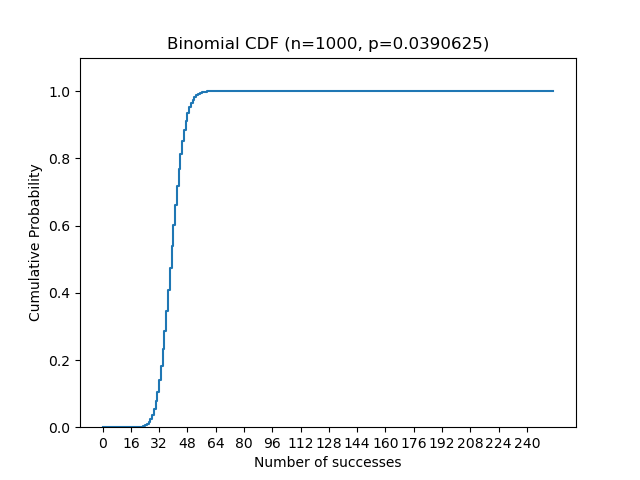
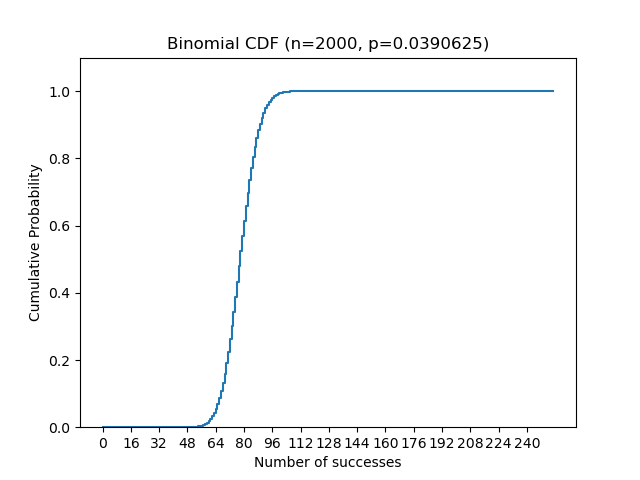
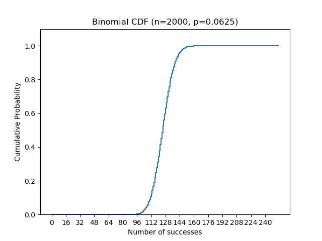

# curso_blockchain_uma_24_vuln2
Vulnerabilidad 2 (Pseudoaleatoriedad) (Parte del curso de Extensión
Universitaria en Tecnologías Blockchain de la Universidad de Málaga 2024).

# Principios de aleatoriedad

En general, salvo errores de operación, no existe aleatoriedad dentro de una máquina.
Por eso, las máquinas recurren a fuentes externas (como Internet o sensores) para
obtener entropía.

Esta fuente de entropía permite a la máquina simular un generador de aleatoriedad
seguro por un tiempo y espacio limitados (pseudoaleatoriedad).

# Aleatoriedad en Ethereum, ¿por qué es un problema?

La Ethereum Virtual Machine es una Maquina de Turing Universal determinista.
Además, la blockchain de Ethereum es una base de datos publica, en la que la
información no está cifrada en general.
La blockchain de Ethereum es una MTU determinista distribuida.
Por otra parte, el código fuente de Ethereum es open source.
Además, el código fuente de los contratos es también open source (o se puede debuggear).

Al combinar todo esto obtenemos en suma un comportamiento predecible y conocible
De hecho, esta es una de las fortalezas de Ethereum, pero en este caso también debilidad
ya que estamos tratando de implementar algún tipo de sorteo.

Esto permite al atacante precomputar parámetros adecuados y podría, bajo
determinadas circunstancias, aprovechar esto para obtener NFTs más
fácilmente.

# Tests, diferentes valores de threshold

El script deploy_test_pseudoaleatoriedad.py simula un atacante que obtiene el
NFT creando cuentas y probando a fuerza bruta.

Uso:
python3 deploy_test_pseudoaleatoriedad.py

Aumentando el tamaño del tipo de datos se incrementaría la complejidad del ataque
al aumentar el espacio de búsqueda, pero el problema de no aleatoriedad
persistiría en cualquier caso.

# Análisis estadístico básico

El problema se puede modelar como una distribución binomial:

$$F(k;n,p) = \Pr(X \le k) = \sum_{i=0}^{\lfloor k \rfloor} {n\choose i}p^i(1-p)^{n-i}$$

donde n es el número de intentos y p la probabilidad de éxito.

El script stats.py devuelve las funciones de distribución acumulada (CDF) para
diferentes valores de n y threshold. La probabilidad p se calcula como
p=threshold/256 ya que el tipo de datos utilizado en la función es int8.
Recordemos que la función de densidad es la derivada de la CDF.

Uso:
stats.py 100 10

Para n=1000 y t=10 obtendremos entre 16 y 64 éxitos (posibles NFTs).

Si aumentamos el número de intentos la curva se desplaza a la derecha.

Si aumentamos el threshold la curva se desplaza a la derecha (menos dificil).

# Caso real

En el caso real habría que tener en cuenta también los otros dos parámetros
(que no añaden seguridad a los efectos de esta PoC) y el vector de ataque
ya que la función es internal y se llama en función de los resultados
de las votaciones de la DAO.

# Posible solución, oráculos (Chainlink)

